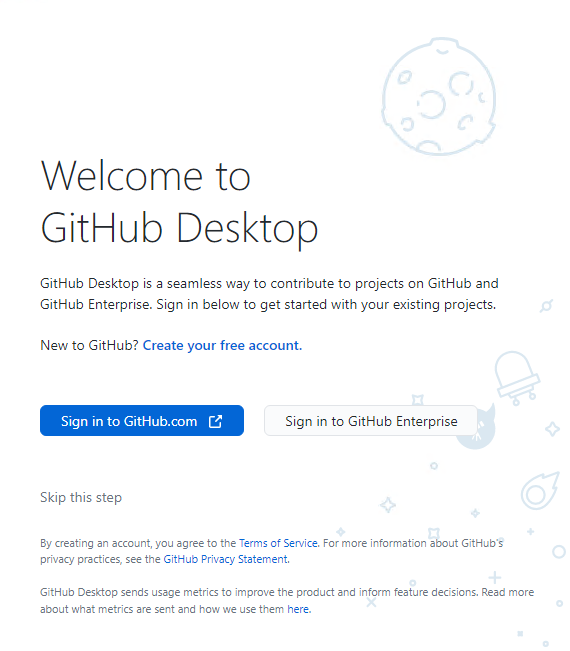
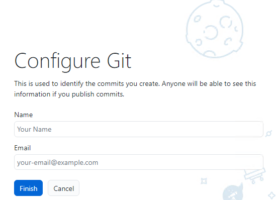

<text-box variant='learningObjectives' name="Learning objectives">

After this section

- You will know how to **install and configure Git** on your local machine.
- You will understand the role of **Git in version control** and how it integrates with **GitHub**.
- You will be able to **set up and authenticate GitHub in VS Code** for seamless collaboration.
- You will know how to **clone a GitHub repository**, make changes, and commit them back.
- You will be able to use **GitHub Codespaces** as an alternative cloud-based development environment.
- You will understand the differences between **local Git workflows** and **cloud-based workflows (Codespaces)**.

</text-box>

To work more effectively with GitHub, it’s essential to integrate it with an IDE like **VS Code**. There are two ways to do this:

---

## Method 1:  Local Setup
This method involves installing Git on your local machine and using the **GitHub Pull Request and Issues extension** in VS Code.

### **Steps to Set Up Git with VS Code:**
1. **Install Git** (Version Control System)  (if not installed)
   - Download and install Git from [Git Downloads](https://git-scm.com/downloads).
   - After installation, verify the installation by running:
     ```sh
     git --version
     ```

2. **Configure Git**

After installing Git, you need to configure Git by providing your full name and email address.You can start [GitHub Desktop](https://github.com/apps/desktop) (if you have in already installed in your personal device, if not you can install it ) and configure using the graphical user interface as shown in the diagram below or use the command line.




***Configure Git with command line***

1. Open Git Bash.
2. Set your username and email, which will be associated with your commits. Use these commands, replacing "Your Name" and "your.email@example.com" with your actual information:

```bash
git config --global user.name "Your Name"
git config --global user.email your.email@example.com
```
***Check your Git Configuration***

```bash
git config --list
```

3. **Install VS Code** (if not installed)
   - Download it from [Visual Studio Code](https://code.visualstudio.com/).

4. **Install GitHub Pull Request and Issues Extension**
   - Open VS Code and go to the **Extensions Marketplace** (`Ctrl + Shift + X` / `Cmd + Shift + X` on macOS).
   - Search for **GitHub Pull Requests and Issues** and install it.
   - Alternatively, install it directly from [VS Code Extensions](https://marketplace.visualstudio.com/items?itemName=GitHub.vscode-pull-request-github).

5. **Authenticate GitHub in VS Code**
   - Open VS Code and navigate to:
     ```
     View > Command Palette (Ctrl + Shift + P / Cmd + Shift + P on macOS)
     ```
   - Search for **"GitHub: Sign in to GitHub"** and follow the prompts.

6. **Clone a GitHub Repository into VS Code**
   - Open VS Code and open the **Command Palette**.
   - Select **"Git: Clone"** and enter the repository URL from GitHub.  (Example Repo Link: https://github.com/Laurea-amk-Leppavaara/github-starter-space)
   - Choose a local folder to save the repository and start coding.

**Read More: For full instructions, refer to the official VS Code guide:**
 [Collaborate on GitHub](https://code.visualstudio.com/docs/sourcecontrol/github)

---

## Method 2: Using GitHub Codespaces (Cloud-Based IDE)
**GitHub Codespaces** is a cloud-based development environment that allows you to code directly in your browser without installing anything locally.

### **Benefits of GitHub Codespaces:**
- No installation required
- Access your code from any device
- Standardized development environment

### **How to Use GitHub Codespaces:**
1. Go to your GitHub repository.
2. Click the **"Code"** button and select the **"Codespaces"** tab.
3. Click **"New codespace"** to launch a fully configured VS Code environment in your browser.

**Watch this short video on how to use GitHub Codespaces:**

<iframe width="560" height="315" src="https://www.youtube.com/embed/SVaqUjBUdMA?si=nrMV2p9_zsw7Ry-d" title="YouTube video player" frameborder="0" allow="accelerometer; autoplay; clipboard-write; encrypted-media; gyroscope; picture-in-picture; web-share" referrerpolicy="strict-origin-when-cross-origin" allowfullscreen></iframe>

 **For more details, visit the official documentation:**
 [GitHub Codespaces](https://docs.github.com/en/codespaces)

---

###  **Which Method Should You Use?**
- **Use the local method** if you prefer working locally and need **full control over your development environment**.
- **Use GitHub Codespaces** if you want to **code from anywhere** without worrying about installations.

##  Basic Git Command Line Reference

Here are some essential Git commands to get started:

| Command | Description |
|---------|-------------|
| `git --version` | Check if Git is installed |
| `git config --global user.name "Your Name"` | Set your Git username |
| `git config --global user.email "your-email@example.com"` | Set your Git email (must match GitHub) |
| `git config --list` | View your Git configuration |
| `git init` | Initialize a new Git repository in a folder |
| `git clone <repo-url>` | Clone a repository from GitHub |
| `git status` | Check the status of your working directory |
| `git add <file>` | Stage a file for commit |
| `git add .` | Stage all modified files for commit |
| `git commit -m "Your commit message"` | Commit changes with a message |
| `git log --oneline --graph --all` | View commit history in a readable format |
| `git branch` | List all branches in the repository |
| `git checkout -b <branch-name>` | Create and switch to a new branch |
| `git merge <branch-name>` | Merge a branch into the current branch |
| `git push origin <branch-name>` | Push changes to GitHub |
| `git pull origin <branch-name>` | Pull the latest changes from GitHub |
| `git remote -v` | Show linked remote repositories |
| `git reset --hard <commit-id>` | Reset to a specific commit (dangerous, use with caution) |

 **For a complete list of Git commands, check the official Git documentation:**
 [Git Command Reference](https://git-scm.com/docs)
